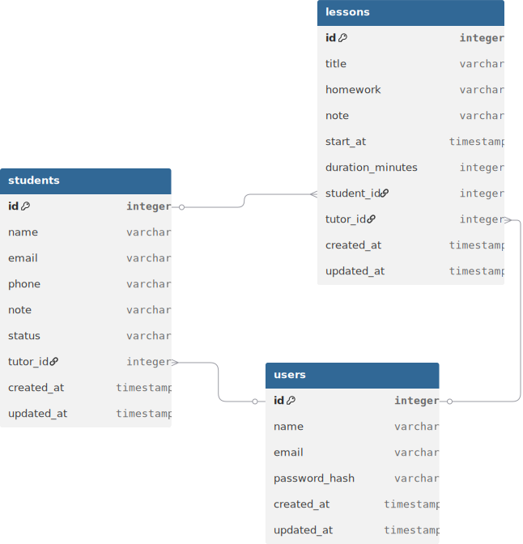
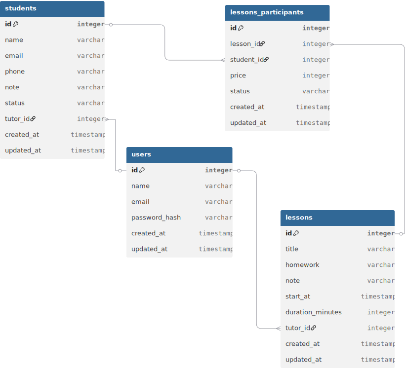

В данной директории инкапсулированы декларативные модели SQLAlchemy ORM. Проектирование базы данных прошло два ключевых этапа:

v2 - я решил, что репетитор также может проводить групповые занятия, а текущий функционал этого не позволяет. поэтому расширил модель, добавив таблицу lessons_participans( важное поле price + status позволяет отмечать, кто уже оплатил и ставить разный ценник за занятия ( был у меня такой случай однажды..., так что такое возможно))

v1 - простая связь 1 занятие - 1 ученик
## Версия 1 — Индивидуальные занятия 

*спроектировано в dbdiagram.io*

Архитектура: Линейная связь "один-к-одному" или "один-ко-многим" напрямую между сущностями `Lesson` (Занятие) и `Student` (Ученик). 
Ограничение: Данная структура жестко ограничивала систему рамками индивидуального обучения. Проведение групповых сессий было невозможно без избыточного дублирования записей уроков в расписании.
## Версия 2 — Поддержка групповых занятий

*спроектировано в dbdiagram.io*

Архитектура: Реализована полноценная связь Many-to-Many между сущностями `Lesson` и `Student` через связующую таблицу `lessons_participants`.
Бизнес-логика промежуточной таблицы: Таблица не просто связывает id урока и студента, но позволяет гибко настраивать разную стоимость одного и того же группового занятия для конкретных учеников (например, с учетом индивидуальных скидок, абонементов или особых условий). `status` (Статус участия и оплаты): Обеспечивает трекинг присутствия студента на уроке, фиксацию факта оплаты, отмены или пропуска по уважительной причине.
